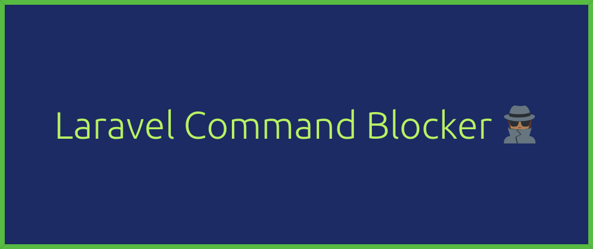

<h1 align="center">Laravel Command Blocker</h1>

The Laravel Command Blocker package provides a seamless solution for hiding and block Laravel commands in specific environments, enhancing the security and control of your Laravel applications.



## Features
- **Environment-Based Command Visibility**: Easily configure the package to hide and/or block specific Laravel commands based on the application's environment.

- **Enhanced Security**: Prevent development or sensitive commands from being visible and/or executable in production or other critical environments.

- **Straightforward Configuration**: Simple configuration settings in your Laravel application make it easy to manage command visibility.

## Installation

You can install the package via Composer:

```bash
composer require murilochianfa/laravel-command-blocker
```

Next, publish the configuration file:

```bash
php artisan vendor:publish --provider="MuriloChianfa\LaravelCommandBlocker\CommandBlockerServiceProvider"
```


### Dependencies

- *Laravel 10.0 or higher.*
- *PHP 8.2 or higher.*

## Configuration

Open the generated configuration file (config/laravel-command-blocker.php) and set up the environments and commands you want to hide or block:

```php
<?php

return [

    /*
    |--------------------------------------------------------------------------
    | Decids if hide the commands
    |--------------------------------------------------------------------------
    |
    | Here you can decide if hide commands in their environments from the command list.
    |
    | Supported: "true", "false"
    |
    */

    'hide' => true,

    /*
    |--------------------------------------------------------------------------
    | Decids if block the commands
    |--------------------------------------------------------------------------
    |
    | Here you can decide if block commands from execution in their environments.
    | or if only hide in the command list
    |
    | Supported: "true", "false"
    |
    */

    'block' => true,

    /*
    |--------------------------------------------------------------------------
    | Environments commands to block
    |--------------------------------------------------------------------------
    |
    | This option controls which commands will be blocked in certain environments.
    |
    */

    'environments' => [
        /**
         * Hide development commands in production environments.
         */
        'production' => [
            'cache:table',
            'clear-compiled',
            'db',
            'db:seed',
            'db:wipe',
            'docs',
            'event:generate',
            'inspire',
            'key:generate',
            'lang:publish',
            'make:cast',
            'make:channel',
            'make:command',
            'make:component',
            'make:controller',
            'make:event',
            'make:exception',
            'make:factory',
            'make:job',
            'make:listener',
            'make:mail',
            'make:middleware',
            'make:migration',
            'make:model',
            'make:notification',
            'make:observer',
            'make:policy',
            'make:provider',
            'make:request',
            'make:resource',
            'make:rule',
            'make:scope',
            'make:seeder',
            'make:test',
            'make:view',
            'migrate:fresh',
            'migrate:install',
            'migrate:refresh',
            'migrate:reset',
            'notifications:table',
            'package:discover',
            'queue:batches-table',
            'queue:failed-table',
            'queue:table',
            'schema:dump',
            'serve',
            'session:table',
            'stub:publish',
            'test',
            'tinker',
            'vendor:publish',
        ],
    ],

];
```

## Commitment to Quality
During package development, try as best as possible to embrace good design and
development practices to try to ensure that this package is as good as it can
be. The checklist for package development includes:

-   ✅ Be fully PSR4 and PSR12 compliant.
-   ✅ Include comprehensive documentation in README.md.
-   ✅ Have no PHPUnit or PHPCS warnings throughout all code.
-   ✅ Achieve as close to 100% code coverage as possible using unit tests.

### Testing

``` bash
composer tests
```

### Security

If you discover any security related issues, please email murilo.chianfa@outlook.com instead of using the issue tracker.

## Credits

- [Murilo Chianfa](https://github.com/MuriloChianfa)
- [All Contributors](../../contributors)

## License

The MIT License (MIT). Please see [License File](LICENSE.md) for more information.
